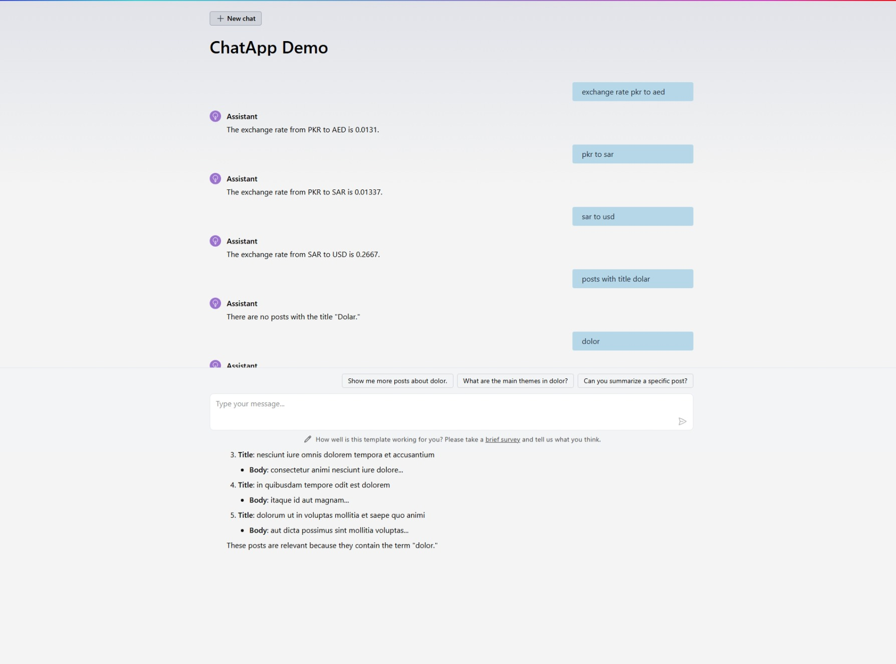

## Consume Third Party APIs

### JSON Placeholder APIs
In Chat.razor page add the following code to consume [JSON Placeholder APIs](https://jsonplaceholder.typicode.com/posts)

Model
```csharp
    public class Dummy_Posts
    {
        public int userId { get; set; }
        public int id { get; set; }
        public string title { get; set; } = null!;
        public string body { get; set; } = null!;
    }
```

Add Azure AI Function Factory
```csharp
AIFunctionFactory.Create(DummyPosts)
```

Hardcode Data Approach.
```csharp

    // Hardcoded dummy data for Data Retrieval
    private async Task<List<Dummy_Posts>> DummyPosts([Description("Post title, correctly capitalized")] string postTitle)
    {
        var response = await new HttpClient().GetFromJsonAsync<List<Dummy_Posts>>("https://jsonplaceholder.typicode.com/posts");
        var filteredPosts = response?.Where(post => post.title.Contains(postTitle, StringComparison.OrdinalIgnoreCase)).ToList();
        return filteredPosts ?? new List<Dummy_Posts>();
    }
}
```

Dependency Injection Approach.
```csharp
    
    @inject IDummy_Services Dummy_Services

    public interface IDummy_Services
    {
        Task<List<Dummy_Posts>> Get_Dummy_Posts(string postTitle);
    }

    public class Dummy_Services : IDummy_Services
    {
        private readonly HttpClient _httpClient;

        public Dummy_Services(HttpClient httpClient)
        {
            _httpClient = httpClient;
        }

        public async Task<List<Dummy_Posts>> Get_Dummy_Posts(string postTitle)
        {
            var response = await _httpClient.GetFromJsonAsync<List<Dummy_Posts>>("https://jsonplaceholder.typicode.com/posts");
            var filteredPosts = response?.Where(post => post.title.Contains(postTitle, StringComparison.OrdinalIgnoreCase)).ToList();
            return filteredPosts ?? new List<Dummy_Posts>();
        }
    }

    // Dependency injection for Data Retrieval
    private async Task<List<Dummy_Posts>> DummyPosts([Description("Post title, correctly capitalized")] string postTitle)
    {
        var response = await Dummy_Services.Get_Dummy_Posts(postTitle);
        return response;
    }

}
```

### Exchange Rate API

Model
```csharp
    public class Dummy_Exchange_Rate
    {
        public string? result { get; set; }
        public string? documentation { get; set; }
        public string? terms_of_use { get; set; }
        public int time_last_update_unix { get; set; }
        public string? time_last_update_utc { get; set; }
        public int time_next_update_unix { get; set; }
        public string? time_next_update_utc { get; set; }
        public string? base_code { get; set; }
        public string? target_code { get; set; }
        public double conversion_rate { get; set; }
    }
```

Add Azure AI Function Factory:
```csharp
AIFunctionFactory.Create(Get_Exchange_Rate)
```

Dependency Injection Approach.
```csharp
    
    @inject IDummy_Services Dummy_Services

    public interface IDummy_Services
    {
        Task<Dummy_Exchange_Rate> Get_Exchange_Rate(string exchangeRate);
    }

    public class Dummy_Services : IDummy_Services
    {
        private readonly HttpClient _httpClient;

        public Dummy_Services(HttpClient httpClient)
        {
            _httpClient = httpClient;
        }

        public async Task<Dummy_Exchange_Rate> Get_Exchange_Rate(string exchangeRate)
        {
            var response = await _httpClient.GetFromJsonAsync<Dummy_Exchange_Rate>($"https://v6.exchangerate-api.com/v6/b62152c24014e1d33697afc5/pair/{exchangeRate}");
            return response ?? new Dummy_Exchange_Rate();
        }
    }

    private string FormatExchangeRate(string input)
    {
        // Remove "exchange rate" or "to" from the input
        var cleanedInput = input.Replace("exchange rate", "", StringComparison.OrdinalIgnoreCase)
                                .Replace("to", "", StringComparison.OrdinalIgnoreCase)
                                .Trim();

        // Split the input into currency codes
        var currencies = cleanedInput.Split(' ', StringSplitOptions.RemoveEmptyEntries);

        if (currencies.Length == 2)
        {
            return $"{currencies[0].ToLower()}/{currencies[1].ToLower()}";
        }

        throw new ArgumentException("Invalid exchange rate format. Please provide input in the format 'exchange rate usd eur' or 'usd to eur'.");
    }

    private async Task<double> Get_Exchange_Rate([Description("Exchange rate")] string exchangeRate)
    {
        var formattedExchangeRate = FormatExchangeRate(exchangeRate);
        var response = await Dummy_Services.Get_Exchange_Rate(formattedExchangeRate);
        return response.conversion_rate;
    }

}
```

### Chat Window
